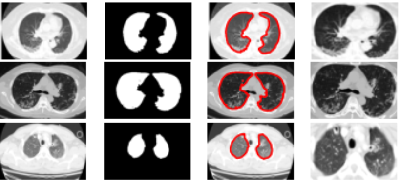

# COVID-19 CAD system
The PyTorch implementation of our paper "[Deep Learning Based COVID-19 Diagnosis by Joint Classification and Segmentation](https://link.springer.com/chapter/10.1007/978-3-030-76620-7_10)"

[Tien-Thanh Tran](https://github.com/thanhtran98), [Thi-Thao Tran](https://www.sites.google.com/site/thaott3i/), [Van-Truong Pham](https://www.sites.google.com/site/truongpvsite)

|   Metrics   | [Liu *et al.*](https://f.hubspotusercontent00.net/hubfs/5059707/KDD%202020%20Papers%20Posters/A%20Fast%20Online%20COVID-19%20Diagnostic%20System%20with%20Chest%20CT%20Scans.pdf) (2020) | [Silva *et al.*](https://www.researchsquare.com/article/rs-41062/v1) (2020) | [Jiang *et al.*](http://noiselab.ucsd.edu/ECE228/projects/Report/10Report.pdf) (2020) | [He *et al.*](https://www.medrxiv.org/content/10.1101/2020.04.13.20063941v1) (2020) | Proposed method |
|:-----------:|:-----------:|:-----------:|:-----------:|:-----------:|:---------------:|
| Accuracy    |     0.85    |   **0.88**  |     0.83    |     0.86    |       0.87      |
| Sensitivity |     0.86    |      _      |      _      |      _      |     **0.91**    |
| F1          |     0.85    |     0.86    |     0.84    |     0.85    |     **0.87**    |
| AUC         |     0.91    |     0.90    |     0.89    |   **0.94**  |       0.91      |
## Requirments
- [PyTorch](https://pytorch.org/)
- [Sklearn](https://scikit-learn.org/stable/)
## Installation
```shell
$ git clone git@github.com:thanhtran98/covid_ct_cad.git
$ cd covid_ct_cad
```
## System
The proposed system can detect COVID-19 from CT scans using deep learning. The system consists of two stages which are *Segmentation stage* and *Classification stage*.  
In *Segmentaion stage*, a modified version of [U-Net](https://arxiv.org/abs/1505.04597) was used to identify lung region and get rid of noisy background.  
In *Classification stage*, we trained the DenseNet-169 with the filtered dataset. Final output represents the probability of those test samples taken from positive patients.
### Result of the Segmentation stage
You can download the pretrained segmentation model [[Here]](https://drive.google.com/file/d/1-1IkDer1q9k7U05LJoR96mQUuX1KSuJ9)



## Dataset
The dataset used to train and evaluate the system was COVID-CT-Dataset from this [repo](https://github.com/UCSD-AI4H/COVID-CT). You can download the dataset and place it in the main repository.  
COVID CT scans are in `./Images-processed/CT_NonCOVID.zip`  
Non-COVID CT scans are in `./Images-processed/CT_NonCOVID.zip`  
The labels and data split in `./Data-split`
## Quick start
### Training
```shell
python train.py --data ./COVID-CT/Images-processed --label ./COVID-CT/Data-split --segment-ckp ./UnetPlus_0909_alldata.pt
```
### Testing
```shell
python test.py --data ./COVID-CT/Images-processed --label ./COVID-CT/Data-split --classify-ckp ./checkpoint/best.pt --segment-ckp ''
```
## Citation
```
@Inbook{Tran2021,
author="Tran, Tien-Thanh and Tran, Thi-Thao and Pham, Van-Truong",
editor="Phuong, Nguyen Hoang and Kreinovich, Vladik",
title="Deep Learning Based COVID-19 Diagnosis by Joint Classification and Segmentation",
bookTitle="Soft Computing: Biomedical and Related Applications",
year="2021",
publisher="Springer International Publishing",
address="Cham",
pages="121--128",
isbn="978-3-030-76620-7"
}
```
## Contact
If you have any questions, please post it on github issues.